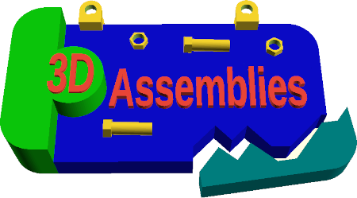

# 3DAssemblies

**3DAssemblies** is a user interface enabling bimanual 3D assemblies (i.e., 2× 6 degrees of freedom). Two 3D parts, choosen from a workspace that showcases libraries of OBJ files, can be loaded in a 3D scene and binded to bimanual input. Input is provided either by two physical passive props(1) (sensed by Polhemus Liberty) or by two 3D mice (3DConnexion SpaceNavigator), thus enabling user experiments to find the best parameters. Once bound to hands, the 3D parts' motion in the 3D scene is activated by two foot pedals that each clutch separately for the left hand and the right hand.

Furthermore, the workspace library is bound to physical cartouches, which are symbolic representations of collections of available 3D fragments. Loading fragments to the 3D scene is supported by a couple of physical casiers(2), representing each the left and the right hand, where one or more cartouches can be sensed. Stacking cartouches on casiers triggers merging of the 3D parts as rendered in the 3D scene. Once merged, a single cartouche from the stack becomes sufficient if the user wants to manipulate stacks of reasonable size. Indeed, this version support only paper-printed cartouches, not cartouches with integrated digital screens. Finally, a third separated casier can be added as preview of the library's part before loading in the 3D scene, and to edit part's assembly trees by stack manipulation.

The source code is written in C and C++, using V4L2 for targets' optical detection by casiers, Qt5 for GUI components, and Irrlicht 1.8 for 3D rendering. Drivers for SpaceNavigator and Polhemus Liberty are also required. Development of cartouche stacks detection from casier was initiated between December 2009 and February 2010 on Debian Lenny. The upgrade to Debian Jessie and development of the manipulation and selection windows, loading of 3D parts in Irrlicht, integration of Polhemus Liberty and 3DConnexion SpaceNavigator devices, took place between July and December 2015.

(1) Patrick Reuter, Guillaume Rivière, Nadine Couture, Nicolas Sorraing, Loïc Espinasse, Robert Vergnieux. 2007. ArcheoTUI - A Tangible User Interface for the Virtual Reassembly of Fractured Archeological Objects. In VAST'07, 8th International Symposium on Virtual Reality, Archaeology and Cultural Heritage (Brighton, United Kingdom, November 27-29, 2007), Eurographics Association, pp. 15-22, 8 pages, 2007. [https://dx.doi.org/10.2312/VAST/VAST07/015-022](https://dx.doi.org/10.2312/VAST/VAST07/015-022)

(2) [https://www.guillaumeriviere.name/cartouchestacks/](https://www.guillaumeriviere.name/cartouchestacks/)

## Author

Guillaume Rivière, [ESTIA](https://www.estia.fr), France. ([@gurivier](https://github.com/gurivier/))

## License

Source code is released under the [MIT](https://choosealicense.com/licenses/mit/) license.

Fabrication files are released under the [CC BY-SA 4.0](https://creativecommons.org/licenses/by-sa/4.0/) license.

Media files are released under the [CC BY-SA 4.0](https://creativecommons.org/licenses/by-sa/4.0/) license.

Documentation is released under the [CC BY-SA 4.0](https://creativecommons.org/licenses/by-sa/4.0/) license.

## Versions' History

* 0.1.6 (2026-10-08): project publication
  * This project publication includes:
    * `bin/`:
      * Gather the binaries of the project
    * `doc/`:
      * `design/`:
        * Source code architecture
        * Views of the GUI
        * Design diagram on a three foot-switch device
      * `implementation/`:
        * Overview diagram of the project
    * `media/`:
      * Some samples of 3D files of broken 3D objects
    * `src/`:
      * The GUI views (Workspace + 3D Scene) with Irrlicht integration in Qt
      * Connexion to the Polhemus Liberty station through USB
      * Connexion to SpaceNavigator devices through Unix sockets
      * The casiers' optical detection of cartouches' stacks

---
 Guillaume Rivière, 2009-2010 [LSU](http://www.lsu.edu) [ESTIA](https://www.estia.fr) [LaBRI](https://www.labri.fr), 2015, 2026 [ESTIA](https://www.estia.fr), France.
